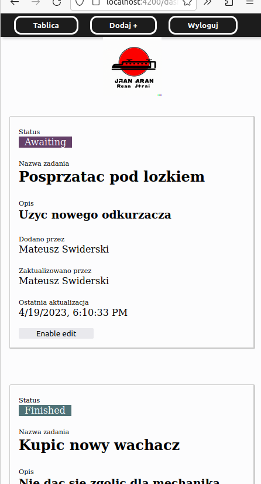

## Run with Docker
```
$ docker-compose up
```

# About
This application is built using the Nest.js framework for the backend and Angular for the frontend. The backend uses a MongoDB database with Mongoose for object modeling and ORM relations.

---------------------------------

The application also includes several features, such as JWT authentication, caching, SCSS styling, HTTP interceptor, and ORM relations. 
